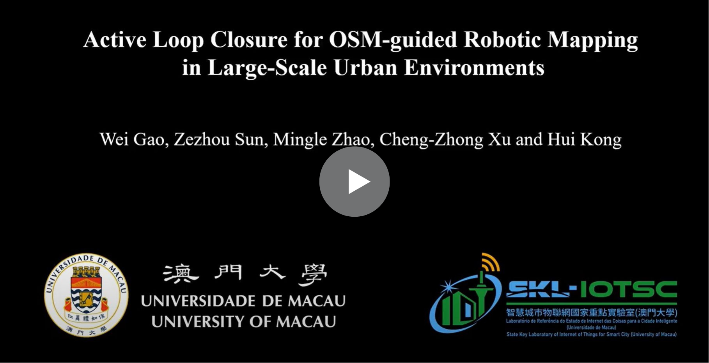

This is the code repository for the IROS'24 paper "Active Loop Closure for OSM-guided Robotic Mapping in Large-Scale Urban Environment"

# 

[](https://www.youtube.com/watch?v=jHr28Vx-M-M "Active Loop Closure for OSM-guided Robotic Mapping in Large-Scale Urban Environment")

# Usage:
The repository has been tested in Ubuntu 20.04 with ROS Noetic. To setup OSM-guided Active Loop Closure(ALC), install the dependencies with command lines below.
1. Dependencies

- [mlpack](https://github.com/mlpack/mlpack)
- [Opencv 4.2](https://github.com/opencv/opencv)
- Eigen3
- [PCL 1.13.1](https://github.com/PointCloudLibrary/pcl)
- OpenMP
- [gtsam 4.0.2](https://github.com/borglab/gtsam)
- [livox_ros_driver2](https://github.com/Livox-SDK/livox_ros_driver2)

2. OSM(OpenStreetMap) Global Path Generation
- 1: Download the [OSM](https://www.openstreetmap.org) file for the area to be explored
- 2: Follow osmplanner.ipynb to generate the optimal global path

3. Quick Start
```bash
### front end ###
roslaunch fast_lio mapping_avia_rot.launch
```

```bash
### terrain_analysis ###
roslaunch vehicle_simulator system_osm_follow.launch
```

```bash
### waypoint ###
roslaunch osmplanner osmplanner.launch
```
```bash
### gps follow ###
roslaunch gps_follow ini_gps.launch
```
```bash
### active loop closure ###
roslaunch gps_follow active_loop.launch
```
```bash
### back end ###
roslaunch aloam_velodyne fastlio_ouster64.launch
```

# Reference:
Wei Gao, Zezhou Sun, Mingle Zhao, Chengzhong Xu, and Hui Kong, Active Loop Closure for OSM-guided Robotic Mapping in Large-Scale Urban Environment, 
IEEE International Conference on Intelligent Robotics and Systems (IROS), 2024. [[**PDF**](https://arxiv.org/pdf/2407.17078)]

# Acknowledgement:
Part of the codes are based on [FAST_LIO_SLAM](https://github.com/gisbi-kim/FAST_LIO_SLAM) and [autonomous exploration development environment](https://github.com/jizhang-cmu/ground_based_autonomy_basic). Thanks for their awesome work.
